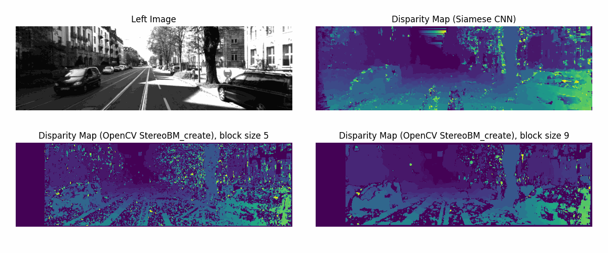
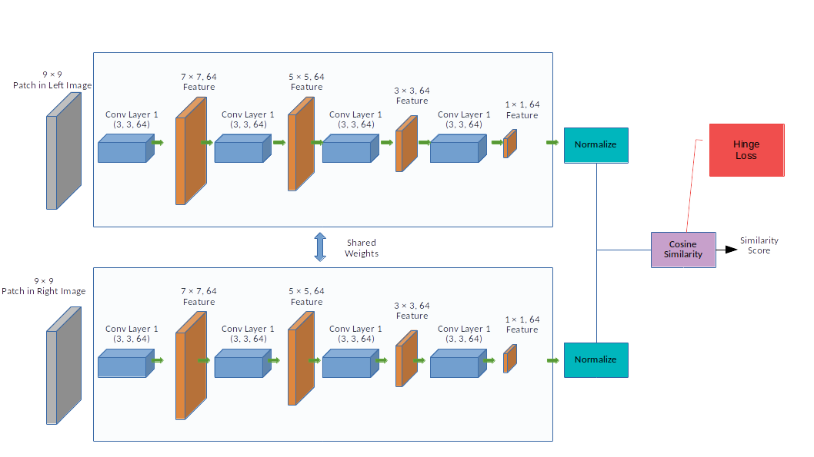

# Siamese CNN for Block Matching in Stereo Images Depth Mapping

Stereo image depth mapping often involves rectifying images and then establishing corresponding points between the left and right images. Patch matching is a common method for finding these corresponding points, where a neighborhood of pixels in both images is compared. Many computer vision libraries offer simple methods like Sum of Absolute Differences (SAD) for comparing patch similarity.

This repository contains a Siamese Convolutional Neural Network trained using Hinge loss. The network is trained on a subset of the KITTI 2015 disparity dataset.

The following figures illustrate the Siamese network architecture and its comparison with the OpenCV block matching algorithm. As depicted, the Siamese network produces higher-quality disparity images.

  

 

  

 

To experiment with more complex neural networks, modify the PyTorch model in `model.py`.
For more intricate models, you can augment the `KITTI_disparity_subset` dataset with more sampe of KITTI.
To generate disparity maps, utilize the functions in `disparity_map.py`, and refer to the example in `example_disparity_KITTI_siamese.py`.
